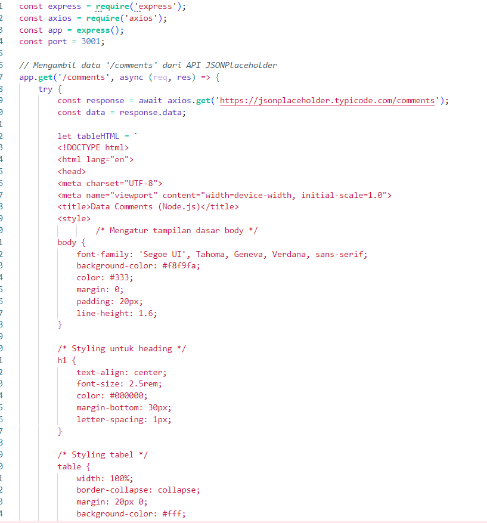
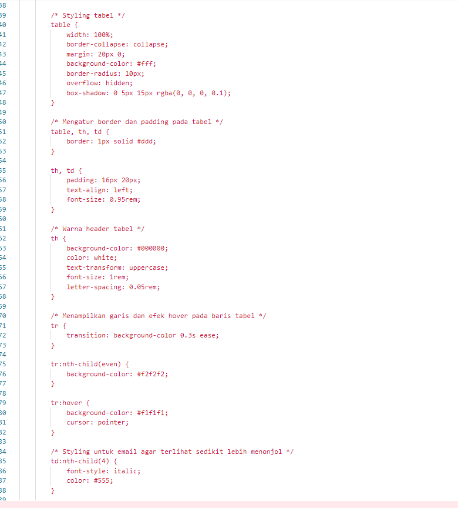
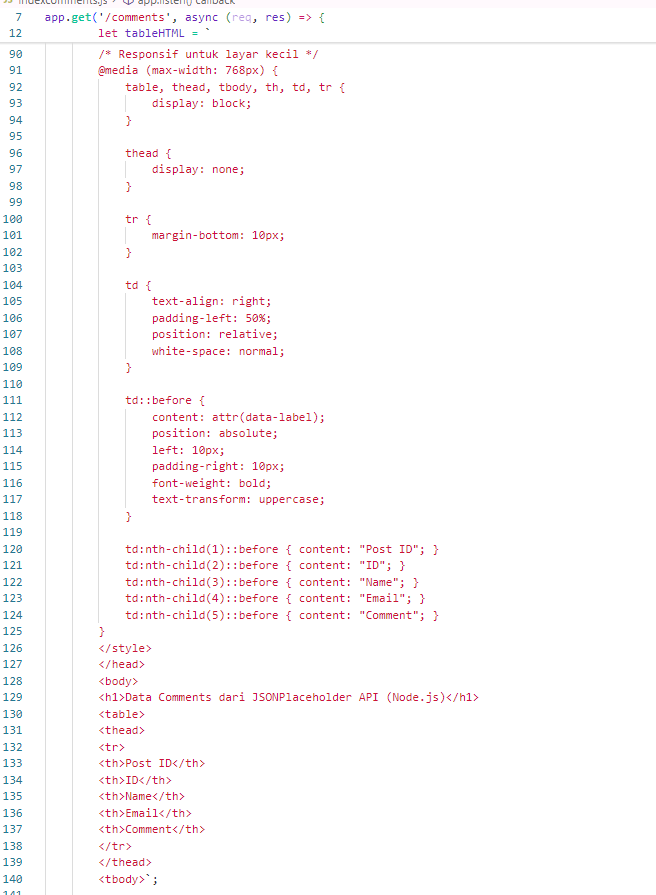
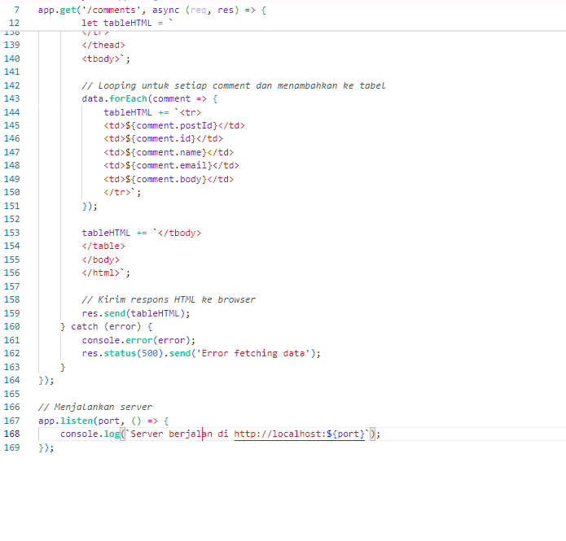
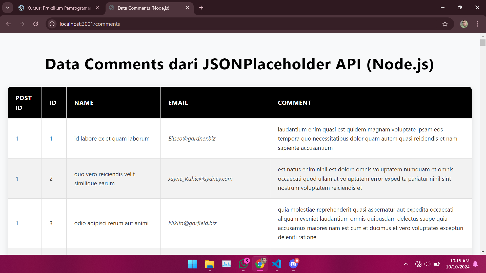
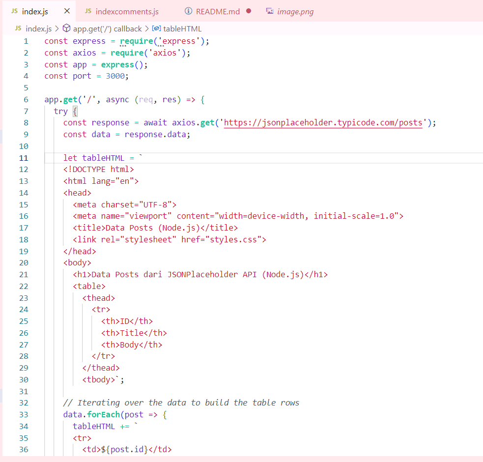
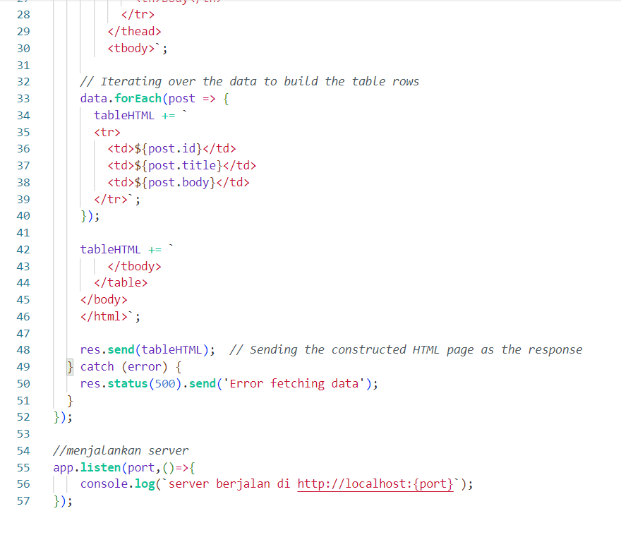
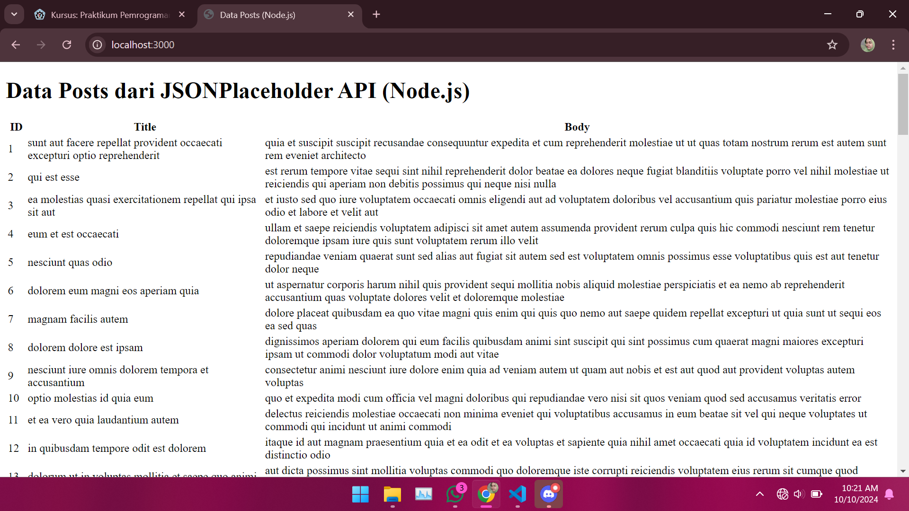

Mengambil data dari resource '/comments'

hasil mengambil data dari resource '/comments'

Menambahkan fitur-fitur pada data berdasarkan 'ID' atau 'Title'

hasil fitur-fitur pada data berdasarkan 'ID' atau 'Title'

